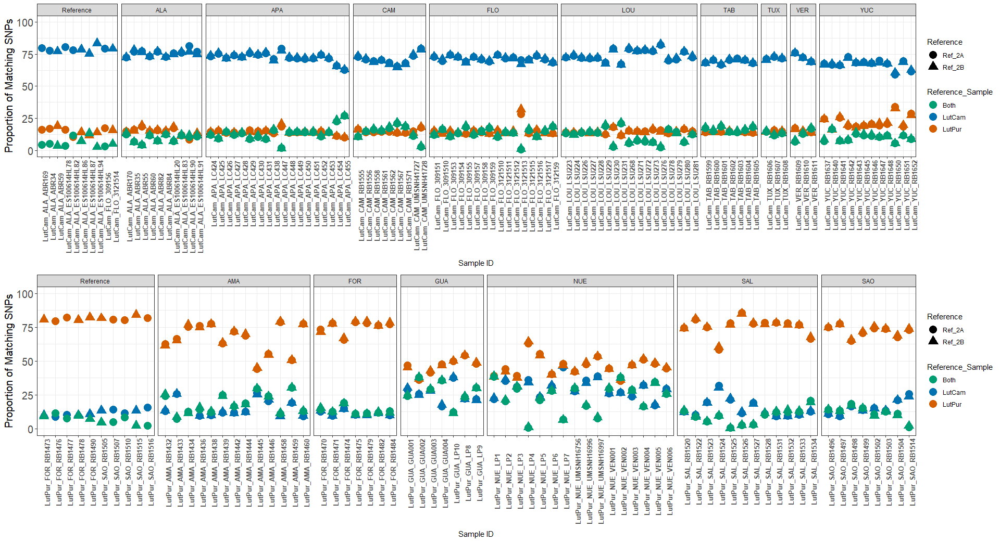

# Snapper RADSeq with SISRS
**Robert Literman**  
**Mayara Matos**  

A walkthrough of an analysis to develop SNPs for differentiation *Lutjanus campechanus* and *L. purpureus*

#### Acquiring data
All data for this project was downloaded from the NCBI database. RAD-Seq data are from the paper [Genomics overrules mitochondrial DNA, siding with morphology on a controversial case of species delimitation](https://royalsocietypublishing.org/doi/full/10.1098/rspb.2018.2924).

We also leverage an existing genome assembly for *L. campechanus* from [Development and characterization of genomic resources for a non-model marine teleost, the red snapper (Lutjanus campechanus, Lutjanidae): Construction of a high-density linkage map, anchoring of genome contigs and comparative genomic analysis](https://pubmed.ncbi.nlm.nih.gov/32348345/).  

We use a modified implementation of the [SISRS bioinformatics pipeline](https://bmcbioinformatics.biomedcentral.com/articles/10.1186/s12859-015-0632-y) to process the data.  

#### Step 1: Read Trimming  

All reads were trimmed using [the BBMap Suite](https://jgi.doe.gov/data-and-tools/bbtools/bb-tools-user-guide/bbmap-guide/), with the following template:

```
bbduk.sh ref=adapters.fa qtrim=w ktrim=r trimq=10 maq=15 minlength=50 in=<SAMPLE>_1.fastq in2=<SAMPLE>_2.fastq out=<ID>_Trim_1.fastq.gz out2=<ID>_Trim_2.fastq.gz &> out_<ID>_Trim
```

##### Trim Results:

| SISRS_ID                | SRR        | Location | Raw_Bases     | Trim_Bases    | Percent_Surviving |
|-------------------------|------------|----------|---------------|---------------|-------------------|
| LutPur_AMA_RB1432       | SRR8647801 | AMA      | 526,021,408   | 524,055,078   | 99.6%             |
| LutPur_AMA_RB1433       | SRR8647802 | AMA      | 770,671,628   | 767,469,321   | 99.6%             |
| LutPur_AMA_RB1434       | SRR8647803 | AMA      | 533,661,648   | 529,373,060   | 99.2%             |
| LutPur_AMA_RB1436       | SRR8647804 | AMA      | 840,757,844   | 837,219,729   | 99.6%             |
| LutPur_AMA_RB1438       | SRR8647805 | AMA      | 464,558,928   | 462,632,504   | 99.6%             |
| LutPur_AMA_RB1439       | SRR8647773 | AMA      | 987,661,324   | 983,558,164   | 99.6%             |
| LutPur_AMA_RB1442       | SRR8647772 | AMA      | 517,620,756   | 515,515,316   | 99.6%             |
| LutPur_AMA_RB1444       | SRR8647771 | AMA      | 454,798,272   | 452,907,169   | 99.6%             |
| LutPur_AMA_RB1445       | SRR8647770 | AMA      | 420,242,268   | 418,608,914   | 99.6%             |
| LutPur_AMA_RB1446       | SRR8647769 | AMA      | 661,272,232   | 658,248,834   | 99.5%             |
| LutPur_AMA_RB1458       | SRR8647768 | AMA      | 705,390,232   | 702,335,336   | 99.6%             |
| LutPur_AMA_RB1459       | SRR8647767 | AMA      | 552,829,844   | 550,237,397   | 99.5%             |
| LutPur_AMA_RB1460       | SRR8647766 | AMA      | 825,226,072   | 821,079,389   | 99.5%             |
| LutPur_FOR_RB1470       | SRR8647775 | FOR      | 291,538,624   | 290,191,436   | 99.5%             |
| LutPur_FOR_RB1471       | SRR8647774 | FOR      | 649,634,368   | 646,790,826   | 99.6%             |
| LutPur_FOR_RB1473       | SRR8647857 | FOR      | 357,482,736   | 355,910,654   | 99.6%             |
| LutPur_FOR_RB1474       | SRR8647858 | FOR      | 278,134,664   | 276,805,476   | 99.5%             |
| LutPur_FOR_RB1475       | SRR8647855 | FOR      | 354,623,752   | 352,967,774   | 99.5%             |
| LutPur_FOR_RB1476       | SRR8647856 | FOR      | 468,521,464   | 466,353,392   | 99.5%             |
| LutPur_FOR_RB1477       | SRR8647853 | FOR      | 199,164,820   | 198,349,227   | 99.6%             |
| LutPur_FOR_RB1478       | SRR8647854 | FOR      | 290,538,960   | 289,353,176   | 99.6%             |
| LutPur_FOR_RB1479       | SRR8647851 | FOR      | 328,873,116   | 327,420,597   | 99.6%             |
| LutPur_FOR_RB1482       | SRR8647852 | FOR      | 317,632,744   | 316,219,035   | 99.6%             |
| LutPur_FOR_RB1484       | SRR8647860 | FOR      | 449,679,208   | 447,563,686   | 99.5%             |
| LutPur_FOR_RB1490       | SRR8647861 | FOR      | 184,981,528   | 184,003,621   | 99.5%             |
| LutPur_GUA_GUA001       | SRR8647779 | GUA      | 426,269,320   | 424,056,863   | 99.5%             |
| LutPur_GUA_GUA002       | SRR8647778 | GUA      | 1,850,542,840 | 1,839,666,299 | 99.4%             |
| LutPur_GUA_GUA003       | SRR8647785 | GUA      | 388,754,916   | 386,463,523   | 99.4%             |
| LutPur_GUA_GUA004       | SRR8647784 | GUA      | 1,045,202,376 | 1,038,667,746 | 99.4%             |
| LutPur_GUA_LP10         | SRR8647837 | GUA      | 136,079,176   | 135,311,976   | 99.4%             |
| LutPur_GUA_LP8          | SRR8647752 | GUA      | 380,908,620   | 379,044,437   | 99.5%             |
| LutPur_GUA_LP9          | SRR8647753 | GUA      | 441,330,156   | 438,975,809   | 99.5%             |
| LutPur_NUE_LP1          | SRR8647838 | NUE      | 530,394,164   | 527,690,325   | 99.5%             |
| LutPur_NUE_LP2          | SRR8647750 | NUE      | 128,357,064   | 127,571,009   | 99.4%             |
| LutPur_NUE_LP3          | SRR8647751 | NUE      | 936,876,088   | 931,885,674   | 99.5%             |
| LutPur_NUE_LP4          | SRR8647748 | NUE      | 16,810,248    | 16,378,580    | 97.4%             |
| LutPur_NUE_LP5          | SRR8647749 | NUE      | 276,921,720   | 275,434,874   | 99.5%             |
| LutPur_NUE_LP6          | SRR8647754 | NUE      | 251,656,468   | 250,385,272   | 99.5%             |
| LutPur_NUE_LP7          | SRR8647755 | NUE      | 58,902,776    | 58,562,082    | 99.4%             |
| LutPur_NUE_UMSNH16756   | SRR8647719 | NUE      | 719,661,588   | 715,661,508   | 99.4%             |
| LutPur_NUE_UMSNH16996   | SRR8647720 | NUE      | 275,952,328   | 274,214,645   | 99.4%             |
| LutPur_NUE_UMSNH16997   | SRR8647721 | NUE      | 228,268,596   | 226,999,040   | 99.4%             |
| LutPur_NUE_VEN001       | SRR8647743 | NUE      | 618,155,444   | 614,831,049   | 99.5%             |
| LutPur_NUE_VEN002       | SRR8647742 | NUE      | 772,149,280   | 768,037,575   | 99.5%             |
| LutPur_NUE_VEN003       | SRR8647741 | NUE      | 848,549,960   | 843,975,760   | 99.5%             |
| LutPur_NUE_VEN004       | SRR8647740 | NUE      | 150,922,088   | 150,146,847   | 99.5%             |
| LutPur_NUE_VEN005       | SRR8647739 | NUE      | 688,885,284   | 685,140,374   | 99.5%             |
| LutPur_NUE_VEN006       | SRR8647738 | NUE      | 323,565,368   | 321,763,036   | 99.4%             |
| LutPur_SAL_RB1520       | SRR8647828 | SAL      | 258,019,780   | 256,847,146   | 99.5%             |
| LutPur_SAL_RB1522       | SRR8647821 | SAL      | 379,174,172   | 377,507,232   | 99.6%             |
| LutPur_SAL_RB1523       | SRR8647822 | SAL      | 52,148,336    | 51,898,586    | 99.5%             |
| LutPur_SAL_RB1524       | SRR8647823 | SAL      | 78,043,796    | 77,560,358    | 99.4%             |
| LutPur_SAL_RB1525       | SRR8647824 | SAL      | 35,424,776    | 35,255,181    | 99.5%             |
| LutPur_SAL_RB1526       | SRR8647819 | SAL      | 71,993,868    | 71,703,773    | 99.6%             |
| LutPur_SAL_RB1527       | SRR8647820 | SAL      | 32,396,888    | 32,034,728    | 98.9%             |
| LutPur_SAL_RB1528       | SRR8647846 | SAL      | 295,187,088   | 293,947,204   | 99.6%             |
| LutPur_SAL_RB1531       | SRR8647845 | SAL      | 1,004,065,308 | 998,655,992   | 99.5%             |
| LutPur_SAL_RB1532       | SRR8647844 | SAL      | 1,175,408,268 | 1,168,529,824 | 99.4%             |
| LutPur_SAL_RB1533       | SRR8647843 | SAL      | 511,034,532   | 508,139,781   | 99.4%             |
| LutPur_SAL_RB1534       | SRR8647850 | SAL      | 486,619,992   | 483,905,285   | 99.4%             |
| LutPur_SAO_RB1496       | SRR8647869 | SAO      | 574,168,336   | 571,263,101   | 99.5%             |
| LutPur_SAO_RB1497       | SRR8647868 | SAO      | 730,063,460   | 725,914,957   | 99.4%             |
| LutPur_SAO_RB1498       | SRR8647871 | SAO      | 506,573,884   | 503,499,279   | 99.4%             |
| LutPur_SAO_RB1499       | SRR8647870 | SAO      | 269,630,296   | 268,373,453   | 99.5%             |
| LutPur_SAO_RB1502       | SRR8647865 | SAO      | 368,803,776   | 366,993,862   | 99.5%             |
| LutPur_SAO_RB1503       | SRR8647864 | SAO      | 320,490,180   | 318,955,962   | 99.5%             |
| LutPur_SAO_RB1504       | SRR8647867 | SAO      | 96,375,040    | 95,976,308    | 99.6%             |
| LutPur_SAO_RB1505       | SRR8647866 | SAO      | 206,464,328   | 205,483,487   | 99.5%             |
| LutPur_SAO_RB1507       | SRR8647877 | SAO      | 129,165,464   | 128,404,887   | 99.4%             |
| LutPur_SAO_RB1510       | SRR8647876 | SAO      | 271,051,188   | 269,892,762   | 99.6%             |
| LutPur_SAO_RB1514       | SRR8647825 | SAO      | 275,112,624   | 273,449,997   | 99.4%             |
| LutPur_SAO_RB1515       | SRR8647826 | SAO      | 101,413,436   | 100,793,857   | 99.4%             |
| LutPur_SAO_RB1516       | SRR8647827 | SAO      | 162,018,324   | 161,128,268   | 99.5%             |
| LutCam_ALA_ABR169       | SRR8647729 | ALA      | 88,654,820    | 88,118,211    | 99.4%             |
| LutCam_ALA_ABR170       | SRR8647728 | ALA      | 584,562,124   | 580,892,901   | 99.4%             |
| LutCam_ALA_ABR34        | SRR8647813 | ALA      | 88,385,296    | 87,775,827    | 99.3%             |
| LutCam_ALA_ABR35        | SRR8647814 | ALA      | 112,158,964   | 111,406,328   | 99.3%             |
| LutCam_ALA_ABR55        | SRR8647811 | ALA      | 91,792,100    | 91,251,476    | 99.4%             |
| LutCam_ALA_ABR59        | SRR8647812 | ALA      | 71,575,908    | 71,055,293    | 99.3%             |
| LutCam_ALA_ABR60        | SRR8647809 | ALA      | 401,296,468   | 398,794,943   | 99.4%             |
| LutCam_ALA_ABR82        | SRR8647810 | ALA      | 159,361,096   | 158,286,783   | 99.3%             |
| LutCam_ALA_ABR84        | SRR8647807 | ALA      | 422,065,124   | 419,434,794   | 99.4%             |
| LutCam_ALA_ES100614HL20 | SRR8647808 | ALA      | 128,360,848   | 127,307,236   | 99.2%             |
| LutCam_ALA_ES100614HL78 | SRR8647815 | ALA      | 37,339,996    | 37,067,105    | 99.3%             |
| LutCam_ALA_ES100614HL82 | SRR8647816 | ALA      | 205,108,968   | 203,706,898   | 99.3%             |
| LutCam_ALA_ES100614HL83 | SRR8647781 | ALA      | 265,497,480   | 263,627,237   | 99.3%             |
| LutCam_ALA_ES100614HL86 | SRR8647780 | ALA      | 109,004,484   | 108,268,066   | 99.3%             |
| LutCam_ALA_ES100614HL87 | SRR8647783 | ALA      | 233,746,108   | 232,447,573   | 99.4%             |
| LutCam_ALA_ES100614HL90 | SRR8647782 | ALA      | 505,482,200   | 502,786,829   | 99.5%             |
| LutCam_ALA_ES100614HL91 | SRR8647777 | ALA      | 299,585,300   | 297,709,154   | 99.4%             |
| LutCam_ALA_ES100614HL94 | SRR8647776 | ALA      | 25,371,204    | 25,121,484    | 99.0%             |
| LutCam_APA_LC424        | SRR8647863 | APA      | 337,265,856   | 335,123,661   | 99.4%             |
| LutCam_APA_LC425        | SRR8647806 | APA      | 292,635,468   | 290,629,547   | 99.3%             |
| LutCam_APA_LC426        | SRR8647878 | APA      | 517,524,608   | 514,249,837   | 99.4%             |
| LutCam_APA_LC427        | SRR8647879 | APA      | 448,703,796   | 445,957,626   | 99.4%             |
| LutCam_APA_LC428        | SRR8647872 | APA      | 440,274,076   | 437,524,458   | 99.4%             |
| LutCam_APA_LC429        | SRR8647873 | APA      | 239,977,840   | 238,523,345   | 99.4%             |
| LutCam_APA_LC430        | SRR8647874 | APA      | 274,393,836   | 272,819,736   | 99.4%             |
| LutCam_APA_LC431        | SRR8647875 | APA      | 246,318,964   | 244,740,885   | 99.4%             |
| LutCam_APA_LC438        | SRR8647859 | APA      | 624,653,432   | 620,553,279   | 99.3%             |
| LutCam_APA_LC447        | SRR8647862 | APA      | 22,276,408    | 21,917,176    | 98.4%             |
| LutCam_APA_LC448        | SRR8647832 | APA      | 490,870,112   | 487,845,509   | 99.4%             |
| LutCam_APA_LC449        | SRR8647831 | APA      | 470,153,572   | 467,281,512   | 99.4%             |
| LutCam_APA_LC450        | SRR8647830 | APA      | 652,293,660   | 648,188,347   | 99.4%             |
| LutCam_APA_LC451        | SRR8647829 | APA      | 608,249,964   | 604,596,019   | 99.4%             |
| LutCam_APA_LC452        | SRR8647836 | APA      | 340,179,192   | 338,110,907   | 99.4%             |
| LutCam_APA_LC453        | SRR8647835 | APA      | 515,148,944   | 511,897,088   | 99.4%             |
| LutCam_APA_LC454        | SRR8647834 | APA      | 3,175,979,312 | 3,154,577,030 | 99.3%             |
| LutCam_APA_LC455        | SRR8647833 | APA      | 3,062,776,996 | 3,043,169,418 | 99.4%             |
| LutCam_CAM_RB1555       | SRR8647849 | CAM      | 277,302,700   | 276,100,747   | 99.6%             |
| LutCam_CAM_RB1556       | SRR8647848 | CAM      | 405,206,888   | 403,215,089   | 99.5%             |
| LutCam_CAM_RB1558       | SRR8647847 | CAM      | 470,921,724   | 468,760,059   | 99.5%             |
| LutCam_CAM_RB1561       | SRR8647842 | CAM      | 407,818,364   | 405,298,023   | 99.4%             |
| LutCam_CAM_RB1562       | SRR8647841 | CAM      | 529,103,476   | 526,458,750   | 99.5%             |
| LutCam_CAM_RB1567       | SRR8647760 | CAM      | 1,064,314,328 | 1,058,734,756 | 99.5%             |
| LutCam_CAM_RB1571       | SRR8647761 | CAM      | 766,331,896   | 761,281,162   | 99.3%             |
| LutCam_CAM_UMSNH41727   | SRR8647745 | CAM      | 188,442,684   | 186,897,922   | 99.2%             |
| LutCam_CAM_UMSNH41728   | SRR8647744 | CAM      | 51,533,436    | 50,613,457    | 98.2%             |
| LutCam_FLO_309151       | SRR8647709 | FLO      | 667,967,160   | 663,626,232   | 99.4%             |
| LutCam_FLO_3091510      | SRR8647708 | FLO      | 450,500,680   | 447,409,158   | 99.3%             |
| LutCam_FLO_309153       | SRR8647711 | FLO      | 435,984,224   | 433,193,524   | 99.4%             |
| LutCam_FLO_309154       | SRR8647710 | FLO      | 552,557,052   | 548,489,811   | 99.3%             |
| LutCam_FLO_309155       | SRR8647705 | FLO      | 965,835,900   | 958,823,685   | 99.3%             |
| LutCam_FLO_309156       | SRR8647704 | FLO      | 76,794,044    | 76,011,650    | 99.0%             |
| LutCam_FLO_309157       | SRR8647707 | FLO      | 471,330,568   | 468,201,406   | 99.3%             |
| LutCam_FLO_309158       | SRR8647706 | FLO      | 813,855,496   | 808,440,539   | 99.3%             |
| LutCam_FLO_309159       | SRR8647703 | FLO      | 1,221,925,496 | 1,213,615,041 | 99.3%             |
| LutCam_FLO_3121510      | SRR8647702 | FLO      | 342,840,548   | 340,688,507   | 99.4%             |
| LutCam_FLO_3121511      | SRR8647737 | FLO      | 592,263,940   | 588,278,760   | 99.3%             |
| LutCam_FLO_3121512      | SRR8647736 | FLO      | 508,879,200   | 505,517,324   | 99.3%             |
| LutCam_FLO_3121513      | SRR8647735 | FLO      | 4,339,044     | 4,275,507     | 98.5%             |
| LutCam_FLO_3121514      | SRR8647734 | FLO      | 76,723,352    | 76,221,186    | 99.3%             |
| LutCam_FLO_3121515      | SRR8647733 | FLO      | 890,805,888   | 884,757,136   | 99.3%             |
| LutCam_FLO_3121516      | SRR8647732 | FLO      | 357,616,380   | 355,015,136   | 99.3%             |
| LutCam_FLO_3121517      | SRR8647731 | FLO      | 859,824,044   | 854,064,734   | 99.3%             |
| LutCam_FLO_312159       | SRR8647730 | FLO      | 1,083,195,112 | 1,075,464,493 | 99.3%             |
| LutCam_LOU_LSU223       | SRR8647746 | LOU      | 621,587,876   | 617,498,576   | 99.3%             |
| LutCam_LOU_LSU224       | SRR8647747 | LOU      | 362,065,160   | 359,747,911   | 99.4%             |
| LutCam_LOU_LSU226       | SRR8647840 | LOU      | 640,724,596   | 636,447,258   | 99.3%             |
| LutCam_LOU_LSU227       | SRR8647839 | LOU      | 796,398,356   | 791,318,819   | 99.4%             |
| LutCam_LOU_LSU228       | SRR8647723 | LOU      | 614,550,152   | 610,291,526   | 99.3%             |
| LutCam_LOU_LSU229       | SRR8647722 | LOU      | 854,653,724   | 848,904,401   | 99.3%             |
| LutCam_LOU_LSU230       | SRR8647725 | LOU      | 58,175,560    | 57,727,672    | 99.2%             |
| LutCam_LOU_LSU231       | SRR8647724 | LOU      | 814,744,048   | 809,563,768   | 99.4%             |
| LutCam_LOU_LSU268       | SRR8647727 | LOU      | 95,206,472    | 94,597,429    | 99.4%             |
| LutCam_LOU_LSU271       | SRR8647726 | LOU      | 163,985,660   | 162,932,529   | 99.4%             |
| LutCam_LOU_LSU272       | SRR8647818 | LOU      | 73,788,172    | 73,313,635    | 99.4%             |
| LutCam_LOU_LSU273       | SRR8647817 | LOU      | 121,848,068   | 121,030,471   | 99.3%             |
| LutCam_LOU_LSU276       | SRR8647796 | LOU      | 33,489,260    | 33,265,241    | 99.3%             |
| LutCam_LOU_LSU278       | SRR8647797 | LOU      | 643,520,112   | 639,099,400   | 99.3%             |
| LutCam_LOU_LSU279       | SRR8647798 | LOU      | 459,648,844   | 456,674,387   | 99.4%             |
| LutCam_LOU_LSU280       | SRR8647799 | LOU      | 121,950,236   | 121,207,200   | 99.4%             |
| LutCam_LOU_LSU281       | SRR8647800 | LOU      | 390,098,236   | 387,527,607   | 99.3%             |
| LutCam_TAB_RB1599       | SRR8647758 | TAB      | 901,023,548   | 895,255,813   | 99.4%             |
| LutCam_TAB_RB1600       | SRR8647759 | TAB      | 711,534,416   | 707,066,261   | 99.4%             |
| LutCam_TAB_RB1601       | SRR8647764 | TAB      | 1,063,940,916 | 1,057,284,247 | 99.4%             |
| LutCam_TAB_RB1602       | SRR8647765 | TAB      | 480,973,576   | 478,054,393   | 99.4%             |
| LutCam_TAB_RB1603       | SRR8647762 | TAB      | 728,200,184   | 723,399,931   | 99.3%             |
| LutCam_TAB_RB1604       | SRR8647763 | TAB      | 980,028,996   | 973,412,006   | 99.3%             |
| LutCam_TAB_RB1605       | SRR8647756 | TAB      | 1,278,206,820 | 1,269,750,589 | 99.3%             |
| LutCam_TUX_RB1606       | SRR8647757 | TUX      | 852,338,948   | 847,917,470   | 99.5%             |
| LutCam_TUX_RB1607       | SRR8647789 | TUX      | 386,727,896   | 384,462,105   | 99.4%             |
| LutCam_TUX_RB1608       | SRR8647788 | TUX      | 585,575,376   | 582,539,873   | 99.5%             |
| LutCam_VER_RB1609       | SRR8647791 | VER      | 130,534,412   | 129,737,277   | 99.4%             |
| LutCam_VER_RB1610       | SRR8647790 | VER      | 516,955,116   | 513,888,774   | 99.4%             |
| LutCam_VER_RB1611       | SRR8647793 | VER      | 1,161,346,924 | 1,155,095,925 | 99.5%             |
| LutCam_YUC_RB1637       | SRR8647792 | YUC      | 118,583,164   | 117,984,695   | 99.5%             |
| LutCam_YUC_RB1640       | SRR8647795 | YUC      | 355,399,988   | 353,566,500   | 99.5%             |
| LutCam_YUC_RB1641       | SRR8647794 | YUC      | 109,436,032   | 108,904,394   | 99.5%             |
| LutCam_YUC_RB1642       | SRR8647787 | YUC      | 102,940,624   | 102,435,760   | 99.5%             |
| LutCam_YUC_RB1643       | SRR8647786 | YUC      | 212,123,816   | 211,082,818   | 99.5%             |
| LutCam_YUC_RB1645       | SRR8647712 | YUC      | 172,328,004   | 171,364,513   | 99.4%             |
| LutCam_YUC_RB1646       | SRR8647713 | YUC      | 176,073,476   | 175,042,297   | 99.4%             |
| LutCam_YUC_RB1647       | SRR8647714 | YUC      | 126,940,988   | 126,275,026   | 99.5%             |
| LutCam_YUC_RB1648       | SRR8647715 | YUC      | 221,488,528   | 220,342,705   | 99.5%             |
| LutCam_YUC_RB1650       | SRR8647716 | YUC      | 80,733,360    | 80,274,791    | 99.4%             |
| LutCam_YUC_RB1651       | SRR8647717 | YUC      | 198,431,412   | 197,368,993   | 99.5%             |
| LutCam_YUC_RB1652       | SRR8647718 | YUC      | 205,525,036   | 204,449,452   | 99.5%             |

#### Step 2: Set up reference genome for mapping  

To make use of the SISRS scripts, the *L. campechanus* reference genome was indexed using *BBMap* and SISRS scripts were called to create accessory files.  

```
mkdir <>/Composite_Genome
cd <>/Composite_Genome

rename.sh <>/lcampe.scf.fasta out=<>/Composite_Genome/contigs.fa prefix=SISRS addprefix=t trd=t
bbmap.sh ref=contigs.fa
python <>/Genome_SiteLengths.py <>/Composite_Genome
```

#### Step 3: Map individual read files against reference genome  

We mapped RAD-Seq data from all samples against the *L. campechanus* reference genome using the default settings in SISRS. The basic template is below:  

```
# Link the reference genome into each folder
cp -as COMPOSITE_DIR/ref .

# Map reads as single-ended
bbwrap.sh in=READS maxindel=99 strictmaxindel=t sam=1.3 ambiguous=toss out=TAXA.sam append=t

# Convert SAM to pileup
samtools view -Su -@ PROCESSORS -F 4 TAXA.sam | samtools sort -@ PROCESSORS - -o SISRS_DIR/TAXA/TAXA.bam
samtools mpileup -f COMPOSITE_GENOME SISRS_DIR/TAXA/TAXA.bam > SISRS_DIR/TAXA/TAXA.pileups

# Use pileup file to create a sample-specific reference genome to refine mapping
python SCRIPT_DIR/specific_genome.py SISRS_DIR/TAXA COMPOSITE_GENOME

# Index new reference
samtools faidx SISRS_DIR/TAXA/contigs.fa
rm -rf ref TAXA.sam TAXA.bam
bbmap.sh ref=contigs.fa

# Remap reads against new reference and convert to pileup
bbwrap.sh in=READS maxindel=99 strictmaxindel=t sam=1.3 ambiguous=toss out=TAXA.sam append=t
samtools view -Su -@ PROCESSORS -F 4 TAXA.sam | samtools sort -@ PROCESSORS - -o SISRS_DIR/TAXA/TAXA.bam
samtools index SISRS_DIR/TAXA/TAXA.bam
samtools mpileup -f COMPOSITE_GENOME SISRS_DIR/TAXA/TAXA.bam > SISRS_DIR/TAXA/TAXA.pileups

# Create a final list of sites, where fixed sites are noted as ACTG-, and any sites with 0 coverage or heterozygosity are noted as "N" 
python SCRIPT_DIR/get_pruned_dict.py SISRS_DIR/TAXA COMPOSITE_DIR 1 1
```

##### Mapping Results:  
| SISRS_ID                | Trim_Bases    | Fixed_Calls | Het_Calls | Unmapped    |
|-------------------------|---------------|-------------|-----------|-------------|
| LutCam_ALA_ABR169       | 88,118,211    | 31,332,661  | 54,857    | 740,161,144 |
| LutCam_ALA_ABR170       | 580,892,901   | 98,709,023  | 316,174   | 672,523,465 |
| LutCam_ALA_ABR34        | 87,775,827    | 33,524,803  | 54,747    | 737,969,112 |
| LutCam_ALA_ABR35        | 111,406,328   | 38,062,338  | 75,019    | 733,411,305 |
| LutCam_ALA_ABR55        | 91,251,476    | 34,781,869  | 53,324    | 736,713,469 |
| LutCam_ALA_ABR59        | 71,055,293    | 29,197,369  | 36,619    | 742,314,674 |
| LutCam_ALA_ABR60        | 398,794,943   | 95,121,260  | 249,335   | 676,178,067 |
| LutCam_ALA_ABR82        | 158,286,783   | 53,023,720  | 117,863   | 718,407,079 |
| LutCam_ALA_ABR84        | 419,434,794   | 91,598,305  | 272,232   | 679,678,125 |
| LutCam_ALA_ES100614HL20 | 127,307,236   | 41,957,102  | 95,655    | 729,495,905 |
| LutCam_ALA_ES100614HL78 | 37,067,105    | 16,672,956  | 22,489    | 754,853,217 |
| LutCam_ALA_ES100614HL82 | 203,706,898   | 54,911,574  | 193,054   | 716,444,034 |
| LutCam_ALA_ES100614HL83 | 263,627,237   | 62,055,226  | 216,759   | 709,276,677 |
| LutCam_ALA_ES100614HL86 | 108,268,066   | 37,282,941  | 93,415    | 734,172,306 |
| LutCam_ALA_ES100614HL87 | 232,447,573   | 55,184,407  | 201,983   | 716,162,272 |
| LutCam_ALA_ES100614HL90 | 502,786,829   | 88,433,704  | 288,761   | 682,826,197 |
| LutCam_ALA_ES100614HL91 | 297,709,154   | 65,239,102  | 207,394   | 706,102,166 |
| LutCam_ALA_ES100614HL94 | 25,121,484    | 12,623,888  | 13,760    | 758,911,014 |
| LutCam_APA_LC424        | 335,123,661   | 77,749,643  | 228,121   | 693,570,898 |
| LutCam_APA_LC425        | 290,629,547   | 78,002,306  | 184,965   | 693,361,391 |
| LutCam_APA_LC426        | 514,249,837   | 100,022,690 | 321,228   | 671,204,744 |
| LutCam_APA_LC427        | 445,957,626   | 72,840,167  | 240,185   | 698,468,310 |
| LutCam_APA_LC428        | 437,524,458   | 89,887,622  | 279,565   | 681,381,475 |
| LutCam_APA_LC429        | 238,523,345   | 59,213,097  | 151,419   | 712,184,146 |
| LutCam_APA_LC430        | 272,819,736   | 62,124,435  | 187,629   | 709,236,598 |
| LutCam_APA_LC431        | 244,740,885   | 59,037,278  | 151,025   | 712,360,359 |
| LutCam_APA_LC438        | 620,553,279   | 113,030,779 | 357,659   | 658,160,224 |
| LutCam_APA_LC447        | 21,917,176    | 10,919,794  | 7,043     | 760,621,825 |
| LutCam_APA_LC448        | 487,845,509   | 96,495,367  | 296,594   | 674,756,701 |
| LutCam_APA_LC449        | 467,281,512   | 92,372,943  | 287,766   | 678,887,953 |
| LutCam_APA_LC450        | 648,188,347   | 112,233,967 | 344,572   | 658,970,123 |
| LutCam_APA_LC451        | 604,596,019   | 105,683,893 | 329,015   | 665,535,754 |
| LutCam_APA_LC452        | 338,110,907   | 69,361,301  | 202,443   | 701,984,918 |
| LutCam_APA_LC453        | 511,897,088   | 92,486,754  | 293,152   | 678,768,756 |
| LutCam_APA_LC454        | 3,154,577,030 | 279,208,585 | 1,479,384 | 490,860,693 |
| LutCam_APA_LC455        | 3,043,169,418 | 246,757,435 | 1,319,408 | 523,471,819 |
| LutCam_CAM_RB1555       | 276,100,747   | 58,156,620  | 184,579   | 713,207,463 |
| LutCam_CAM_RB1556       | 403,215,089   | 63,764,013  | 281,846   | 707,502,803 |
| LutCam_CAM_RB1558       | 468,760,059   | 70,456,704  | 362,304   | 700,729,654 |
| LutCam_CAM_RB1561       | 405,298,023   | 67,504,760  | 328,430   | 703,715,472 |
| LutCam_CAM_RB1562       | 526,458,750   | 73,233,227  | 402,977   | 697,912,458 |
| LutCam_CAM_RB1567       | 1,058,734,756 | 116,741,380 | 630,566   | 654,176,716 |
| LutCam_CAM_RB1571       | 761,281,162   | 92,088,452  | 461,356   | 678,998,854 |
| LutCam_CAM_UMSNH41727   | 186,897,922   | 48,942,789  | 181,787   | 722,424,086 |
| LutCam_CAM_UMSNH41728   | 50,613,457    | 20,277,560  | 26,828    | 751,244,274 |
| LutCam_FLO_309151       | 663,626,232   | 84,517,885  | 481,980   | 686,548,797 |
| LutCam_FLO_3091510      | 447,409,158   | 82,066,477  | 328,859   | 689,153,326 |
| LutCam_FLO_309153       | 433,193,524   | 61,743,103  | 351,512   | 709,454,047 |
| LutCam_FLO_309154       | 548,489,811   | 102,227,906 | 389,434   | 668,931,322 |
| LutCam_FLO_309155       | 958,823,685   | 122,966,795 | 637,452   | 647,944,415 |
| LutCam_FLO_309156       | 76,011,650    | 30,185,556  | 41,037    | 741,322,069 |
| LutCam_FLO_309157       | 468,201,406   | 68,552,946  | 361,689   | 702,634,027 |
| LutCam_FLO_309158       | 808,440,539   | 104,734,132 | 510,250   | 666,304,280 |
| LutCam_FLO_309159       | 1,213,615,041 | 135,860,145 | 750,680   | 634,937,837 |
| LutCam_FLO_3121510      | 340,688,507   | 74,597,683  | 209,291   | 696,741,688 |
| LutCam_FLO_3121511      | 588,278,760   | 89,034,263  | 316,160   | 682,198,239 |
| LutCam_FLO_3121512      | 505,517,324   | 82,981,036  | 300,016   | 688,267,610 |
| LutCam_FLO_3121513      | 4,275,507     | 1,968,900   | 663       | 769,579,099 |
| LutCam_FLO_3121514      | 76,221,186    | 27,078,224  | 53,490    | 744,416,948 |
| LutCam_FLO_3121515      | 884,757,136   | 110,611,491 | 580,169   | 660,357,002 |
| LutCam_FLO_3121516      | 355,015,136   | 73,553,129  | 341,809   | 697,653,724 |
| LutCam_FLO_3121517      | 854,064,734   | 111,266,775 | 520,793   | 659,761,094 |
| LutCam_FLO_312159       | 1,075,464,493 | 145,103,282 | 543,766   | 625,901,614 |
| LutCam_LOU_LSU223       | 617,498,576   | 80,926,440  | 337,663   | 690,284,559 |
| LutCam_LOU_LSU224       | 359,747,911   | 68,648,542  | 231,795   | 702,668,325 |
| LutCam_LOU_LSU226       | 636,447,258   | 106,349,850 | 336,589   | 664,862,223 |
| LutCam_LOU_LSU227       | 791,318,819   | 115,412,002 | 379,648   | 655,757,012 |
| LutCam_LOU_LSU228       | 610,291,526   | 106,312,776 | 328,298   | 664,907,588 |
| LutCam_LOU_LSU229       | 848,904,401   | 113,317,549 | 455,436   | 657,775,677 |
| LutCam_LOU_LSU230       | 57,727,672    | 25,943,684  | 29,699    | 745,575,279 |
| LutCam_LOU_LSU231       | 809,563,768   | 103,454,677 | 469,116   | 667,624,869 |
| LutCam_LOU_LSU268       | 94,597,429    | 32,871,474  | 62,449    | 738,614,739 |
| LutCam_LOU_LSU271       | 162,932,529   | 44,703,971  | 116,442   | 726,728,249 |
| LutCam_LOU_LSU272       | 73,313,635    | 27,271,540  | 61,953    | 744,215,169 |
| LutCam_LOU_LSU273       | 121,030,471   | 40,160,351  | 79,324    | 731,308,987 |
| LutCam_LOU_LSU276       | 33,265,241    | 15,358,415  | 18,292    | 756,171,955 |
| LutCam_LOU_LSU278       | 639,099,400   | 129,200,715 | 409,401   | 641,938,546 |
| LutCam_LOU_LSU279       | 456,674,387   | 104,070,563 | 286,369   | 667,191,730 |
| LutCam_LOU_LSU280       | 121,207,200   | 42,140,393  | 78,810    | 729,329,459 |
| LutCam_LOU_LSU281       | 387,527,607   | 91,106,743  | 245,942   | 680,195,977 |
| LutCam_TAB_RB1599       | 895,255,813   | 101,054,094 | 482,895   | 670,011,673 |
| LutCam_TAB_RB1600       | 707,066,261   | 85,351,276  | 356,535   | 685,840,851 |
| LutCam_TAB_RB1601       | 1,057,284,247 | 103,676,959 | 561,575   | 667,310,128 |
| LutCam_TAB_RB1602       | 478,054,393   | 68,926,012  | 294,252   | 702,328,398 |
| LutCam_TAB_RB1603       | 723,399,931   | 83,087,306  | 362,997   | 688,098,359 |
| LutCam_TAB_RB1604       | 973,412,006   | 106,342,009 | 462,130   | 664,744,523 |
| LutCam_TAB_RB1605       | 1,269,750,589 | 112,014,519 | 565,254   | 658,968,889 |
| LutCam_TUX_RB1606       | 847,917,470   | 62,544,204  | 350,733   | 708,653,725 |
| LutCam_TUX_RB1607       | 384,462,105   | 56,904,369  | 223,321   | 714,420,972 |
| LutCam_TUX_RB1608       | 582,539,873   | 56,455,793  | 283,869   | 714,809,000 |
| LutCam_VER_RB1609       | 129,737,277   | 45,343,736  | 84,788    | 726,120,138 |
| LutCam_VER_RB1610       | 513,888,774   | 68,100,254  | 275,848   | 703,172,560 |
| LutCam_VER_RB1611       | 1,155,095,925 | 70,081,193  | 494,129   | 700,973,340 |
| LutCam_YUC_RB1637       | 117,984,695   | 26,694,318  | 121,564   | 744,732,780 |
| LutCam_YUC_RB1640       | 353,566,500   | 55,090,270  | 401,599   | 716,056,793 |
| LutCam_YUC_RB1641       | 108,904,394   | 34,937,971  | 157,651   | 736,453,040 |
| LutCam_YUC_RB1642       | 102,435,760   | 33,229,636  | 128,881   | 738,190,145 |
| LutCam_YUC_RB1643       | 211,082,818   | 44,904,647  | 258,467   | 726,385,548 |
| LutCam_YUC_RB1645       | 171,364,513   | 44,832,572  | 241,220   | 726,474,870 |
| LutCam_YUC_RB1646       | 175,042,297   | 43,363,559  | 233,644   | 727,951,459 |
| LutCam_YUC_RB1647       | 126,275,026   | 38,612,809  | 159,121   | 732,776,732 |
| LutCam_YUC_RB1648       | 220,342,705   | 41,175,859  | 213,841   | 730,158,962 |
| LutCam_YUC_RB1650       | 80,274,791    | 21,124,334  | 106,444   | 750,317,884 |
| LutCam_YUC_RB1651       | 197,368,993   | 47,195,473  | 274,530   | 724,078,659 |
| LutCam_YUC_RB1652       | 204,449,452   | 34,925,696  | 232,950   | 736,390,016 |
| LutPur_AMA_RB1432       | 524,055,078   | 68,877,907  | 240,269   | 702,430,486 |
| LutPur_AMA_RB1433       | 767,469,321   | 30,551,168  | 177,146   | 740,820,348 |
| LutPur_AMA_RB1434       | 529,373,060   | 110,654,227 | 356,209   | 660,538,226 |
| LutPur_AMA_RB1436       | 837,219,729   | 92,726,745  | 348,447   | 678,473,470 |
| LutPur_AMA_RB1438       | 462,632,504   | 64,949,478  | 212,666   | 706,386,518 |
| LutPur_AMA_RB1439       | 983,558,164   | 98,317,155  | 386,360   | 672,845,147 |
| LutPur_AMA_RB1442       | 515,515,316   | 69,486,693  | 236,022   | 701,825,947 |
| LutPur_AMA_RB1444       | 452,907,169   | 65,504,275  | 213,421   | 705,830,966 |
| LutPur_AMA_RB1445       | 418,608,914   | 63,698,700  | 214,558   | 707,635,404 |
| LutPur_AMA_RB1446       | 658,248,834   | 78,744,652  | 280,723   | 692,523,287 |
| LutPur_AMA_RB1458       | 702,335,336   | 79,917,838  | 272,781   | 691,358,043 |
| LutPur_AMA_RB1459       | 550,237,397   | 73,605,556  | 304,733   | 697,638,373 |
| LutPur_AMA_RB1460       | 821,079,389   | 84,831,508  | 353,552   | 686,363,602 |
| LutPur_FOR_RB1470       | 290,191,436   | 54,964,460  | 179,786   | 716,404,416 |
| LutPur_FOR_RB1471       | 646,790,826   | 75,693,987  | 315,778   | 695,538,897 |
| LutPur_FOR_RB1473       | 355,910,654   | 59,237,606  | 200,611   | 712,110,445 |
| LutPur_FOR_RB1474       | 276,805,476   | 53,142,489  | 177,239   | 718,228,934 |
| LutPur_FOR_RB1475       | 352,967,774   | 57,697,974  | 206,784   | 713,643,904 |
| LutPur_FOR_RB1476       | 466,353,392   | 64,986,008  | 253,105   | 706,309,549 |
| LutPur_FOR_RB1477       | 198,349,227   | 46,029,582  | 131,071   | 725,388,009 |
| LutPur_FOR_RB1478       | 289,353,176   | 55,374,837  | 179,697   | 715,994,128 |
| LutPur_FOR_RB1479       | 327,420,597   | 58,546,128  | 194,999   | 712,807,535 |
| LutPur_FOR_RB1482       | 316,219,035   | 57,583,670  | 188,494   | 713,776,498 |
| LutPur_FOR_RB1484       | 447,563,686   | 67,342,806  | 240,855   | 703,965,001 |
| LutPur_FOR_RB1490       | 184,003,621   | 43,773,074  | 122,159   | 727,653,429 |
| LutPur_GUA_GUA001       | 424,056,863   | 83,288,649  | 220,227   | 688,039,786 |
| LutPur_GUA_GUA002       | 1,839,666,299 | 117,080,132 | 1,122,147 | 653,346,383 |
| LutPur_GUA_GUA003       | 386,463,523   | 59,548,597  | 226,785   | 711,773,280 |
| LutPur_GUA_GUA004       | 1,038,667,746 | 106,157,727 | 601,907   | 664,789,028 |
| LutPur_GUA_LP10         | 135,311,976   | 47,617,774  | 77,319    | 723,853,569 |
| LutPur_GUA_LP8          | 379,044,437   | 77,515,598  | 217,276   | 693,815,788 |
| LutPur_GUA_LP9          | 438,975,809   | 90,891,378  | 263,869   | 680,393,415 |
| LutPur_NUE_LP1          | 527,690,325   | 99,293,179  | 327,387   | 671,928,096 |
| LutPur_NUE_LP2          | 127,571,009   | 42,263,968  | 97,794    | 729,186,900 |
| LutPur_NUE_LP3          | 931,885,674   | 136,925,253 | 413,283   | 634,210,126 |
| LutPur_NUE_LP4          | 16,378,580    | 7,481,462   | 3,167     | 764,064,033 |
| LutPur_NUE_LP5          | 275,434,874   | 67,640,494  | 169,523   | 703,738,645 |
| LutPur_NUE_LP6          | 250,385,272   | 58,845,518  | 181,726   | 712,521,418 |
| LutPur_NUE_LP7          | 58,562,082    | 27,742,534  | 28,040    | 743,778,088 |
| LutPur_NUE_UMSNH16756   | 715,661,508   | 55,892,005  | 244,778   | 715,411,879 |
| LutPur_NUE_UMSNH16996   | 274,214,645   | 34,757,258  | 121,251   | 736,670,153 |
| LutPur_NUE_UMSNH16997   | 226,999,040   | 14,759,400  | 24,166    | 756,765,096 |
| LutPur_NUE_VEN001       | 614,831,049   | 103,826,039 | 310,782   | 667,411,841 |
| LutPur_NUE_VEN002       | 768,037,575   | 112,047,031 | 350,118   | 659,151,513 |
| LutPur_NUE_VEN003       | 843,975,760   | 127,503,269 | 387,667   | 643,657,726 |
| LutPur_NUE_VEN004       | 150,146,847   | 47,291,037  | 87,335    | 724,170,290 |
| LutPur_NUE_VEN005       | 685,140,374   | 110,220,512 | 346,161   | 660,981,989 |
| LutPur_NUE_VEN006       | 321,763,036   | 79,497,820  | 218,927   | 691,831,915 |
| LutPur_SAL_RB1520       | 256,847,146   | 45,619,168  | 158,695   | 725,770,799 |
| LutPur_SAL_RB1522       | 377,507,232   | 50,286,241  | 174,165   | 721,088,256 |
| LutPur_SAL_RB1523       | 51,898,586    | 20,099,772  | 28,474    | 751,420,416 |
| LutPur_SAL_RB1524       | 77,560,358    | 27,387,740  | 45,614    | 744,115,308 |
| LutPur_SAL_RB1525       | 35,255,181    | 2,759,917   | 1,185     | 768,787,560 |
| LutPur_SAL_RB1526       | 71,703,773    | 20,093,431  | 26,072    | 751,429,159 |
| LutPur_SAL_RB1527       | 32,034,728    | 12,613,201  | 11,134    | 758,924,327 |
| LutPur_SAL_RB1528       | 293,947,204   | 48,569,950  | 173,169   | 722,805,543 |
| LutPur_SAL_RB1531       | 998,655,992   | 67,963,970  | 375,269   | 703,209,423 |
| LutPur_SAL_RB1532       | 1,168,529,824 | 77,905,470  | 435,447   | 693,207,745 |
| LutPur_SAL_RB1533       | 508,139,781   | 55,830,747  | 256,436   | 715,461,479 |
| LutPur_SAL_RB1534       | 483,905,285   | 58,159,694  | 252,312   | 713,136,656 |
| LutPur_SAO_RB1496       | 571,263,101   | 71,360,624  | 270,173   | 699,917,865 |
| LutPur_SAO_RB1497       | 725,914,957   | 71,620,034  | 324,742   | 699,603,886 |
| LutPur_SAO_RB1498       | 503,499,279   | 68,027,575  | 261,655   | 703,259,432 |
| LutPur_SAO_RB1499       | 268,373,453   | 54,374,756  | 166,399   | 717,007,507 |
| LutPur_SAO_RB1502       | 366,993,862   | 50,387,043  | 131,116   | 721,030,503 |
| LutPur_SAO_RB1503       | 318,955,962   | 54,177,708  | 157,890   | 717,213,064 |
| LutPur_SAO_RB1504       | 95,976,308    | 31,600,031  | 55,613    | 739,893,018 |
| LutPur_SAO_RB1505       | 205,483,487   | 33,475,309  | 53,340    | 738,020,013 |
| LutPur_SAO_RB1507       | 128,404,887   | 27,070,521  | 38,381    | 744,439,760 |
| LutPur_SAO_RB1510       | 269,892,762   | 55,539,029  | 143,771   | 715,865,862 |
| LutPur_SAO_RB1514       | 273,449,997   | 4,967,910   | 3,105     | 766,577,647 |
| LutPur_SAO_RB1515       | 100,793,857   | 16,859,887  | 16,841    | 754,671,934 |
| LutPur_SAO_RB1516       | 161,128,268   | 18,585,101  | 17,965    | 752,945,596 |

#### Step 4: Create the first set of reference samples  
Choosing appropriate reference samples is critical for designing effective species-informative SNPs. To that end, our final SNP set was assessed using an iterative set of comparisons and filtering. Based on results from ["Genomics overrules mitochondrial DNA, siding with morphology on a controversial case of species delimitation"](https://royalsocietypublishing.org/doi/full/10.1098/rspb.2018.2924), we started our search using *L. campechanus* samples from Alabama and Florida, and *L. purpureus* samples from Fortaleza and São Luís. Based on the read mapping results above, we calculated the pairwise similarity between (1) Alabama *L. campechanus* and Fortaleza *L. purpureus* and (2) Florida *L. campechanus* and São Luís *L. purpureus*.  

##### Pairwise Results:  
  

Although in both cases the species were more similar to their own species than the alternate species, results from the Alabama/Fortaleza comparison appeared more refined, and we chose our first set of reference samples from these populations. From each population we chose 4 samples based on the following metric:  

```
Sorting Metric = (Median Number of Sites Shared Between All Samples * Median Percent Identity with the Matching Species)/(Median Percent Identity with the Alternate Species)
```

In this way, we are selecting samples with a larger amount of information (high number of co-called sites), and also a higher relative similarity with the correct species. From these 8 total samples, we split them into two sets of species pairs to generate two independent reference datasets. To generate the first set of species-informative SNPs, we analyzed the mapping data from the first round of mapping and isolated sites that were:  

1) Fixed in all four specimens   
2) Identical within species  
3) Divergent between species  

##### Round 1 SNP Results:  
**Ref_1A:** 24,179 SNPs  
**Ref_1B:** 22,121 SNPs  

#### Step 5: Use SNPs from Reference Sets 1A/1B to classify samples from Florida, Alabama, Fortaleza, and São Luís  
Based on the SNPs generated above, we screened the mapping results from all samples from Florida, Alabama, Fortaleza, and São Luís, and assessed alleles at all SNPs sites if they were either fixed within the specimen, or had biallelic variation.  

##### Round 1 SNP Classification:  
  

**Basic Takeaways:**  
1. These SNPs were useful at differentiating species from these populations.  
    - Median *L. campechanus* SNP matching rates were 80.4% (ALA) and 75.6% (FLO)
    - Median *L. purpureus* SNP matching rates were 76.3% (FOR) and 75.7% (SAO)  

2. Based on medians, <15% of SNPs matched the alternate species across populations  

3. Across samples, 8.6% - 13.6% of sites had alleles associated with both species  

4. Results were very similar between reference sets.  
    - Between reference sets, the median difference between *L. campechanus* SNPs was 1.3%
    - Between reference sets, the median difference between *L. purpureus* SNPs was 0.52%

#### Step 6: Create the second set of reference samples  
Based on results from the first round of SNP-based classification, we chose a new set of reference samples. For the second round of reference samples, we chose the 10 samples per species (still limited to ALA/FLO + FOR/SAO) with the lowest proportional matching to the (1) alternate species or (2) both species. Two new sets of reference samples (Ref_2A/Ref_2B) were designed  each containing 5 specimens per species. To generate SNPs, we pooled reads from specimens together by reference set and re-mapped them against the reference genome. By pooling the reads together, the SISRS mapping scripts will isolate sites that are fixed within the pool.  

##### Mapping Results:  
| SISRS_ID      | Specimen_Count | Fixed_Calls | Het_Calls | Unmapped    |
|---------------|----------------|-------------|-----------|-------------|
| Ref_2A_LutCam | 5              | 87,347,556  | 471,968   | 683,729,138 |
| Ref_2A_LutPur | 5              | 92,481,587  | 630,041   | 678,437,034 |
| Ref_2B_LutCam | 5              | 90,136,931  | 477,712   | 680,934,019 |
| Ref_2B_LutPur | 5              | 98,056,804  | 660,393   | 672,831,465 |

To generate the second set of species-informative SNPs, for both sets of reference samples (2A/2B) we isolated sites that were:  

1) Fixed in both pools (i.e. Fixed [or missing] in all selected *L. purpureus* and *L. campechanus*)  
2) Identical within pools  
3) Divergent between pools  
4) Present in at least 2/5 specimens per pool  
5) For SNPs identified in both Reference Set 2A and 2B, we also removed SNPs where the SNP results varied across reference sets   

##### Round 2 SNP Results:  
**Ref_2A:** 19,252 SNPs  
**Ref_2B:** 19,720 SNPs  

#### Step 7: Use SNPs from Reference Sets 2A/2B to classify samples from all populations  
Based on the SNPs generated above, we screened the mapping results from all samples, and assessed alleles at all SNPs sites if they were either fixed within the specimen, or had biallelic variation.  

##### Round 2 SNP Classification:  
  

**Basic Takeaways:**  
1. The *L. campechanus* samples are largely uniform, although a few samples appear introgressed.  
2. Introgression is much more common in *L. purpureus*, especially in Nueva and La Guajira (NUE + GUE).  

#### Step 7: Create the third set of reference samples  
Based on results from the second round of SNP-based classification, we chose a new set of reference samples. For the third round of reference samples, we chose the 20 samples per species from all populations with the lowest proportional matching to the (1) alternate species or (2) both species. Two new sets of reference samples (Ref_3A/Ref_3B) were designed  each containing 10 specimens per species. To generate SNPs, we pooled reads from specimens together by reference set and re-mapped them against the reference genome. By pooling the reads together, the SISRS mapping scripts will isolate sites that are fixed within the pool.  

##### Mapping Results:  
| SISRS_ID      | Specimen_Count | Fixed_Calls | Het_Calls | Unmapped    |
|---------------|----------------|-------------|-----------|-------------|
| Ref_3A_LutCam | 10             | 137,669,408 | 879,701   | 632,999,553 |
| Ref_3A_LutPur | 10             | 150,060,547 | 1,587,340 | 619,900,775 |
| Ref_3B_LutCam | 10             | 120,973,714 | 817,794   | 649,757,154 |
| Ref_3B_LutPur | 10             | 124,072,757 | 1,120,598 | 646,355,307 |

To generate the third set of species-informative SNPs, for both sets of reference samples (3A/3B) we isolated sites that were:  

1) Fixed in both pools (i.e. Fixed [or missing] in all selected *L. purpureus* and *L. campechanus*)  
2) Identical within pools  
3) Divergent between pools  
4) Present in at least 2/10 specimens per pool  
5) For SNPs identified in both Reference Set 3A and 3B, we also removed SNPs where the SNP results varied across reference sets   

##### Round 3 SNP Results:  
**Ref_3A:** 26,738 SNPs  
**Ref_3B:** 24,213 SNPs  

#### Step 8: Use SNPs from Reference Sets 3A/3B to re-classify samples from all populations  
Based on the SNPs generated above, we screened the mapping results from all samples, and assessed alleles at all SNPs sites if they were either fixed within the specimen, or had biallelic variation.  

##### Round 3 SNP Classification:  
  

#### Step 9: Create the final set of reference SNPs  
To create the final set of reference SNPs, we did a few rounds of sanity filtering.  

1. Combined all SNPs from Reference Sets 3A + 3B  
2. Choose the top 15 samples per species based on the lowest proportion of mismatching SNPs  
3. Remove any SNPs where any of these 15 samples had more than one allele  
4. Remove any SNPs where any of these 15 samples had a non-identifying allele  

Then, we filtered these SNPs down to those present in 2, 3, 4, or 5 specimens per species.  

##### Final SNP Counts:  
Covered by 2 specimens per species: 12,636 SNPs  
Covered by 3 specimens per species: 8,546 SNPs  
Covered by 4 specimens per species: 5,799 SNPs  
Covered by 5 specimens per species: 4,111 SNPs  

We then re-classified all samples using each of these SNP sets.  

  


